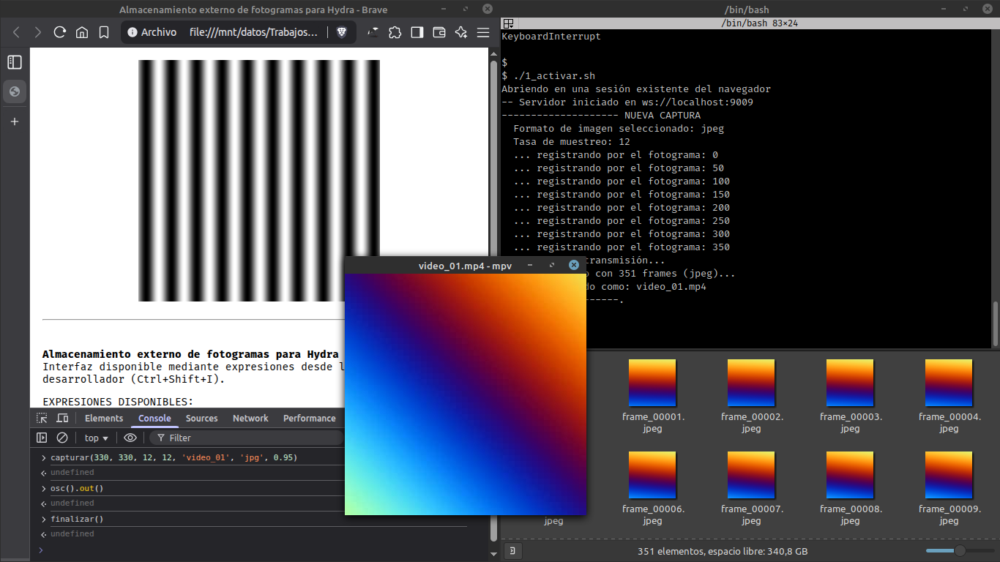

# Almacenamiento externo de fotogramas para Hydra

Este proyecto es una exploración para encontrar algún método que permita almacenar en disco los imágenes dinámicamente generadas en un canvas de html.

Particularmente está configurado para que la generación de imágenes se realize mediante [Hydra](https://hydra.ojack.xyz). Aunque, con los ajustes necesarios, podría utilizarse en cualquier canvas.

Requiere del uso de python para establecer un servidor que reciba las imágenes y las almacene. Además de algunas librerías específicas indicadas en `requirements.txt`.

## Modo de uso

1. Ejecutar el servidor disponible en `server.py`.
2. Abrir el `webclient/index.html` desde cualquier browser.
3. Ejecutar los comandos necesarios, indicados en la misma página, desde la consola de desarrollador.

También están disponibles algunos scripts en bash para automatizar ciertos pasos comunes.

## Pendiente

+ Mejoras de rendimiento cuando el framerate o las dimensiones de los fotogramas crece. En este intento inicial estoy usando websocket para transmitir las imágenes.
+ Probarlo en otros sistemas operativos. Solamente probado en GNU/Linux.
+ Crear alguna extensión para Hydra que permita disponer de la funcionalidad. En esta prueba inicial, simplemente modifiqué algunos puntos específicos del código de `hydra-synth.js` para poder agregar las características que creí necesitar.

Cualquier sugerencia será tenida en cuenta.
